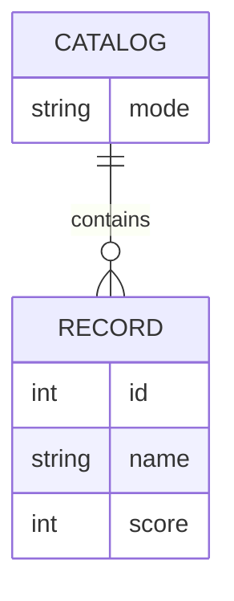

# Domain model

Service2 holds a single catalog, which is always in one of two modes and holds
zero or more scored records depending on that mode.

- **Catalog** is a singleton: Service2 holds exactly one, whose `mode` is
`full` or `empty`. Full mode holds the 10 fixed records; empty mode holds
none.
- **Record** is a fixed, named, scored item — `id`, `name`, `score` — seeded
verbatim from the PRD's full-catalog data.

