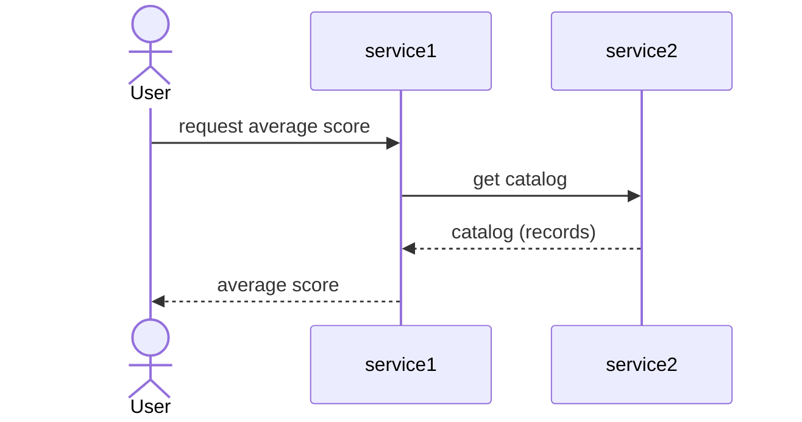

# Get the average score

A User asks Service1 for the average score; Service1 fetches whatever catalog Service2 currently serves and computes the average from it.

```mermaid
sequenceDiagram
    actor User
    participant service1
    participant service2

    User->>service1: request average score
    service1->>service2: get catalog
    service2-->>service1: catalog (records)
    service1-->>User: average score
```

